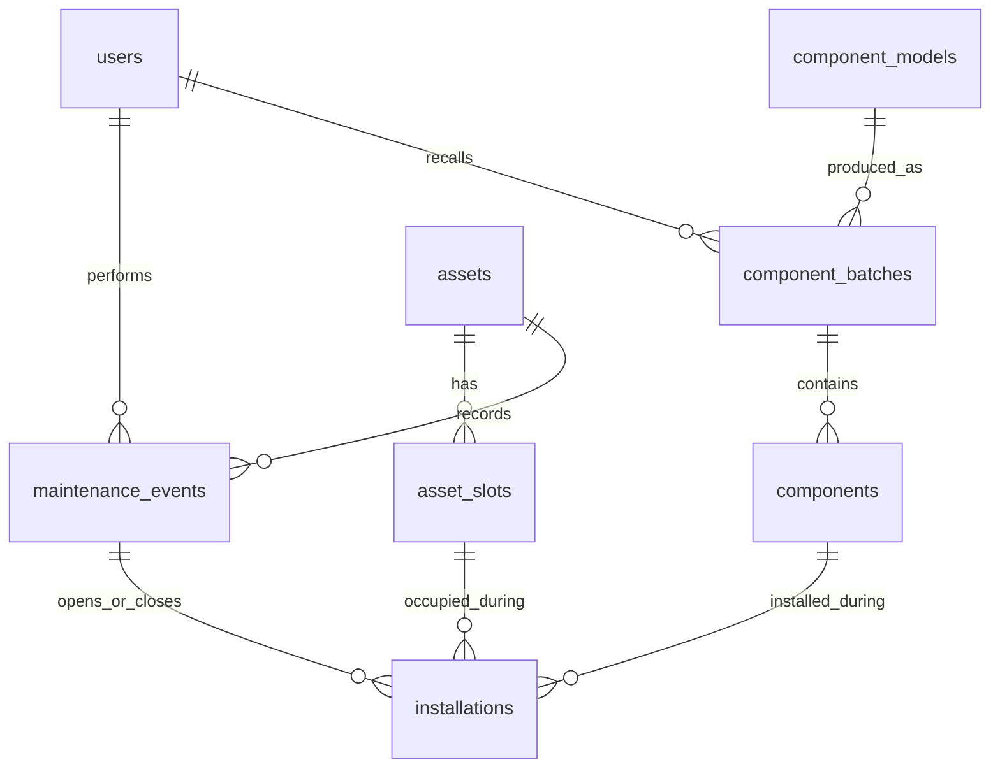

# LifeTrace：需求与技术设计

## 1. 需求基线

目标用户为大学硬件实验室维修人员与管理员。实验一允许自选题，采用 LifeTrace 代替选课系统的业务背景；数据库能力与课件要求一一对应。

| PPT 显示页码 | 要求 | LifeTrace 对应 |
|---|---|---|
| 3 | 源码、表结构、接口说明、可复现测试 | 源码、schema.sql、OpenAPI、自动化测试 |
| 15–16 | 登记、查询、建立关系、解除关系 | 登记资产/部件，查询组成，安装/拆卸 |
| 17–22 | REST、输入校验、参数化 SQL | FastAPI/Pydantic、统一错误、绑定参数 |
| 27–28 | 多步事务及 INSERT 失败回滚 | 关闭旧安装 + 新建安装 + 维修审计原子提交 |
| 29 | 重复、无效输入、资源满额 | 唯一身份、外键、槽位占用 |
| 29 | 并发竞争 | 同部件、同槽位、同旧安装的竞争 |
| 29 | 重启与恢复 | 真实重启 API 进程和 PostgreSQL 容器后比较历史 |

第一版不包含登录、复杂权限、采购、财务、IoT、嵌套组件、历史回填和部件独立维修事件。`users.role` 是逻辑角色，界面不会把它解释成经过认证的权限。

## 2. 技术决策

采用 React + FastAPI + PostgreSQL 的前后端分离单体。选择依据是前端交互生态、明确的 API 契约和 PostgreSQL 对范围约束的直接支持。FastAPI 官方模板也采用 React、PostgreSQL、Vite 和 Playwright；项目借鉴组合，按八表业务独立实现，没有复制认证功能。

SQLAlchemy 2 Core 负责连接池、参数绑定与事务，关键查询保持显式 SQL，便于课程展示。数据库结构由 SQL/Alembic 管理，不通过 ORM 自动建表。同步路由在线程池中执行同步驱动，各事务使用独立连接。

UI 采用 Tailwind 与 Radix 可访问性原语，组件源码可编辑，提供 shadcn 配置供后续扩展。视觉采用“精密实验室档案”方向：石墨色导航、暖纸色内容、工程橙操作与红色召回。Noto Sans SC、Noto Serif SC 和 IBM Plex Mono 随构建本地提供，中文字体按 Unicode 范围加载；图标打包到静态资源。首页组成图读取真实安装关系，节点可进入部件履历。详见 [前端优化记录](frontend-refresh.md)。

参考：[FastAPI 官方模板](https://fastapi.tiangolo.com/project-generation/)、[React](https://react.dev/)、[PostgreSQL 范围类型](https://www.postgresql.org/docs/18/rangetypes.html)、[SQLAlchemy Core](https://docs.sqlalchemy.org/en/20/core/)、[TanStack Query](https://tanstack.com/query/latest/docs/framework/react/overview)、[Playwright](https://playwright.dev/docs/intro)。

## 3. 关系模型



`Batch → Component → Installation(t) → Slot → Asset` 是来源与影响分析链路。安装表保存关系的有效时间，不保存冗余的 current_component、installed 或 affected_assets。型号属性与物理部件身份分离，减少重复。

## 4. 数据字典

所有主键为 bigint identity。关系引用均使用 `ON DELETE RESTRICT`。时间点为 `timestamptz`，生产/购置日期为 `date`。

| 表 | 字段 | 规则 |
|---|---|---|
| users | id, name, role, created_at | 姓名非空；角色 TECHNICIAN/MANAGER |
| assets | id, asset_code, asset_type, model_name, status, acquired_at, created_at | 编号唯一；ACTIVE/RETIRED；不改写身份 |
| asset_slots | id, asset_id, slot_name, allowed_type, created_at | 同资产槽位名唯一；创建时间用于历史查询 |
| component_models | id, component_type, manufacturer, model_name, description | 型号来源不可改写 |
| component_batches | id, component_model_id, batch_code, manufactured_at, recall_status, recalled_at, recalled_by, recall_reason | 批次唯一；NORMAL/RECALLED；召回必须有时间、原因、操作者 |
| components | id, serial_no, batch_id, condition_status, created_at | 序列号唯一；GOOD/DEFECTIVE/RETIRED；来源不可改写 |
| maintenance_events | id, asset_id, technician_id, event_type, occurred_at, note | INSTALL/REMOVE/SWAP；审计记录禁止修改和删除 |
| installations | id, asset_slot_id, component_id, installed_at, removed_at, installed_event_id, removed_event_id | 结束严格晚于开始；结束时间/事件同时为空或非空 |

仅新增槽位，没有重命名、转移槽位接口。设备退役前必须拆空槽位。历史引用阻止物理删除；已关闭安装不可修改，未关闭安装只能关闭一次。

## 5. 约束分工

**数据库负责：** 主键、外键、唯一编号、状态 CHECK、时间 CHECK、active 部分唯一索引、完整历史区间排斥约束、历史保护触发器。

```sql
CREATE UNIQUE INDEX ux_component_active ON installations(component_id)
WHERE removed_at IS NULL;

-- 同部件不能拥有交叠的历史安装区间，NULL 上界表示无穷未来
EXCLUDE USING gist (
  component_id WITH =,
  tstzrange(installed_at, removed_at, '[)') WITH &&
);
```

同槽位另有对应唯一索引和排斥约束。部分索引服务当前组成查询，也提供直观的课程约束示例；排斥约束覆盖已结束历史。

**事务服务负责：** 资产状态、槽位归属、部件状态、类型兼容、批次召回、请求的旧安装是否仍然有效、维修事件与对应资产/时间的一致性。直接绕过 API 手写 SQL 并不具备全部业务校验，SQL 管理工具只用于受控教学与维护。

## 6. 时间与事务

有效区间统一为左闭右开 `[installed_at, removed_at)`。更换时旧部件 removed_at 等于新部件 installed_at，因此边界时刻只存在新部件。

外部查询必须带时区；Web 日期选择器明确按北京时间构造 `+08:00`。后端不接受客户端维修时间，在取得锁后调用数据库时钟；若相关最新安装时间不小于当前时间，则递增一微秒。初始化历史是独立受控工具。

更换事务顺序：

1. 锁资产，锁槽位，验证归属、状态与操作人员。
2. 读取当前安装，核对 `expected_installation_id`。
3. 锁批次（id 升序），锁新旧部件（id 升序）。
4. 重新核查新部件占用、状态、类型和召回情况。
5. 创建维修事件、关闭旧安装、插入新安装。
6. 一起 COMMIT；任何失败回滚整个事务。

隔离级别为 READ COMMITTED；锁在提交后释放。召回同样锁批次：召回先完成则安装被拒绝；安装先完成则召回等待，并把已安装设备纳入影响。退役锁资产，与维修和添加槽位互斥。

锁等待上限 5 秒，事务内 SQL 上限 15 秒。锁超时、死锁和序列化错误返回可重试的 503；业务冲突/约束失败返回 409。前端不自动重放写请求，避免已提交但响应中断时重复执行。

## 7. 查询与索引

当前组成用槽位 LEFT JOIN active 安装，保留空槽位。历史组成使用 `installed_at <= at AND (removed_at > at OR removed_at IS NULL)`，并排除尚未创建的槽位。

召回影响从部件与安装关系查询，按资产分组去重，同时保留每条暴露明细。历史暴露包含当前使用。时间轴读取安装与拆卸事件，并合并批次召回记录；拆卸后的零件也能看到来源批次的召回。

索引覆盖资产槽位、批次部件、型号批次、资产事件时间及槽位/部件安装时间。性能实测见 `performance.json`，不能把数据库内单次执行时间等同于 HTTP 延迟或承诺吞吐量。

## 8. 工程与部署

开发模式 Vite 代理 API；部署模式 FastAPI 提供构建后的 SPA。静态资源前缀为 `/static`，避免与 `/assets/{id}` 页面路由冲突。生产容器启动先迁移，普通启动不运行种子重置。

测试、E2E、性能和重启验收分别使用不同数据库。GitHub Actions 已提供配置，本次仅运行本地等价检查，不声称远程 CI 已执行。环境变量提供数据库地址，源码中默认值仅用于本地虚构数据。
