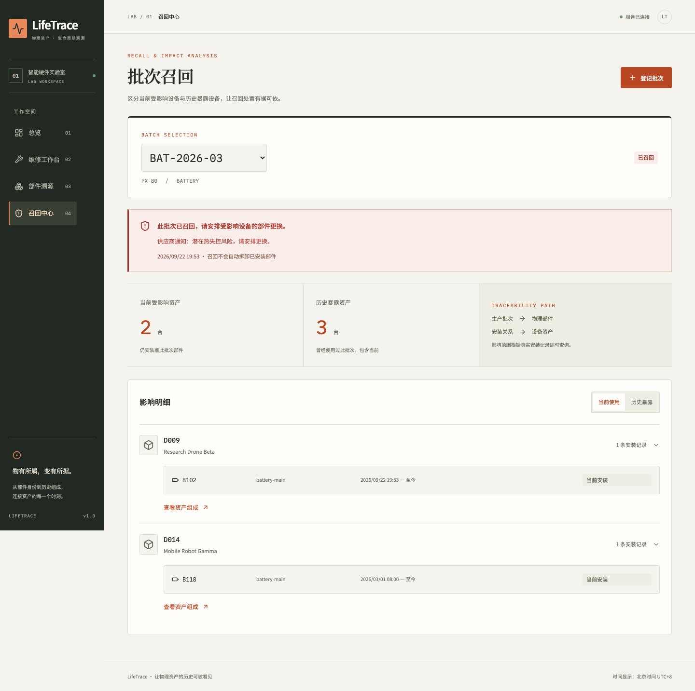

# 数据库实验一：LifeTrace

姓名、学号、班级：由提交者补充。

## 实验目的

使用 Web 前后端与关系数据库实现一个完整业务闭环，验证关系建模、主外键约束、参数化 SQL、JOIN 查询、事务原子性、并发竞争和持久性。

项目把传统设备登记扩展为物理资产的时态组成管理。设备保留固定身份，具体部件拥有独立序列号，安装关系保存起止时间，部件通过批次追溯来源。

## 需求与选型

第一版管理资产、槽位、型号、批次、部件、维修事件和操作人员。主要操作为安装、拆卸、更换、召回；主要查询为当前组成、历史组成、部件履历、当前召回影响及历史暴露。

实现采用 React 19 + TypeScript + FastAPI + PostgreSQL 18。前端以组件组织表单、时间轴和影响明细；后端提供类型化 API；数据库使用八张核心业务表和 Alembic 版本表。SQLAlchemy Core 负责参数化执行，不隐藏关键 SQL 与事务过程。

需求对应、ER 图与数据字典见 [design.md](design.md)，完整 DDL 见 [schema.sql](../schema.sql)。

## 实现方法

### 关系与规范化

型号表保存部件类型和制造商；批次表引用型号并保存生产与召回信息；物理部件引用批次，避免每块电池重复存储型号信息。安装表连接具体部件与设备槽位。一个槽位在不同时间可以有不同部件，一个部件也可以依次在不同设备使用。

### 数据库约束

资产编号、序列号、批次编号唯一；同资产槽位名唯一。外键拒绝无效引用并阻止删除被历史引用的对象。CHECK 约束限定状态和起止时间，部分唯一索引禁止多个当前安装。GiST 排斥约束进一步禁止完整历史时间区间重叠。触发器保护身份、来源和已写入的履历。

### 更换事务

系统在事务中锁定相关资源，验证新部件，然后写维修事件、关闭旧安装、插入新安装。遇到异常时统一回滚，避免用户要求“更换”却留下空槽位。

时间使用带时区时间戳，区间统一为左闭右开。当前状态从安装历史推导，无需同步维护冗余字段。历史查询在指定时刻筛选有效区间。

### 召回与并发

召回只修改批次状态，不直接删除安装。影响查询沿批次、部件、安装、槽位、资产关系连接得到，并按资产去重。当前影响要求安装未结束，历史暴露不做该限制。

安装与召回共用批次行锁，按提交顺序确定结果。新安装在召回先提交时被拒绝；安装先提交时随后被召回影响查询发现。槽位锁和旧安装 id 也防止过期页面覆盖另一位维修人员的更换。

### 界面设计

五个页面分别呈现总览、资产组成、维修工作台、部件时间轴和召回中心。登记入口使用弹窗，操作前显示更换预览，错误在表单内反馈。历史快照不展示维修入口，避免把历史配置当成当前操作目标。移动端调整为单列布局，支持键盘焦点与 Esc 关闭弹窗。

## 测试方法与结果

使用真实 PostgreSQL 的独立数据库运行约束、接口、历史、回滚和并发测试。回滚测试故意让新安装 INSERT 在旧安装关闭后失败；并发测试使用独立连接与同步屏障，并控制召回竞争两个顺序。另使用 Playwright 验证浏览器中的完整操作链路，实际重启 API 进程和数据库容器验证持久性。

10 万条安装记录的性能数据通过 EXPLAIN ANALYZE 记录。详细执行结果、环境、测试范围和原始证据见 [测试报告](test-report.md)。

开发验证中发现并修复了两个具体问题：历史保护触发器跨表字段访问导致召回失败；静态文件 `/assets` 前缀与资产详情页路径冲突导致刷新 404。前者用按表分支处理并增加迁移，后者改用 `/static` 静态资源路径。

## 实验结论与局限

LifeTrace 实现了“身份不变、组成随时间演化”的关系模型，能够重建历史组成并追踪部件跨设备流转。数据库约束和事务使物理世界的不变量具有可执行的保证，而不只依赖界面限制。

第一版是单机本地教学应用，没有认证、历史校正、嵌套组件和供应链流程。重启测试验证已提交记录的持久性，不等同于真实断电或硬件故障测试。后续扩展应分别设计认证、部件自身维修事件、历史校正审计和更大规模数据分页，避免在八表 MVP 中混入无关业务。
